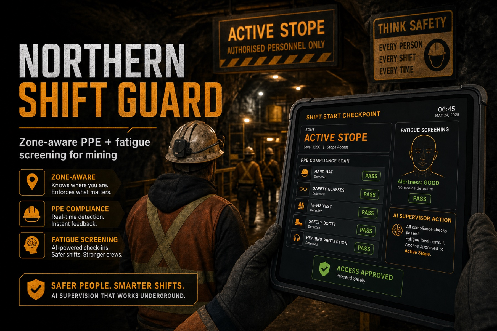
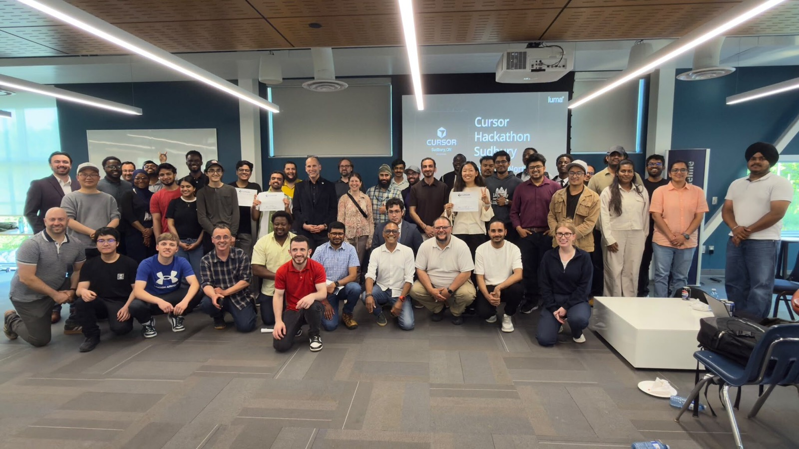
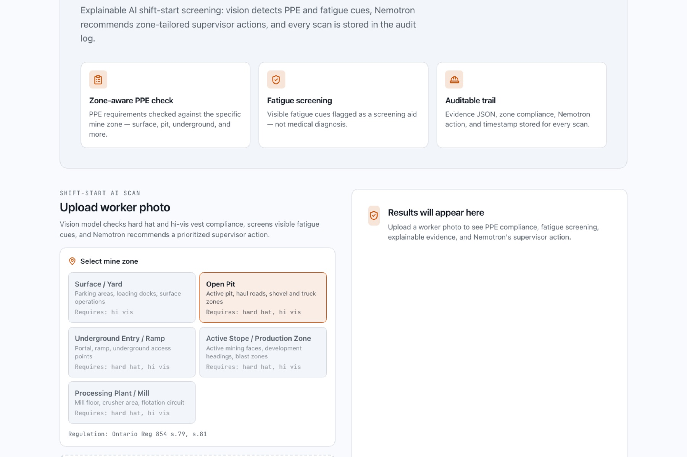
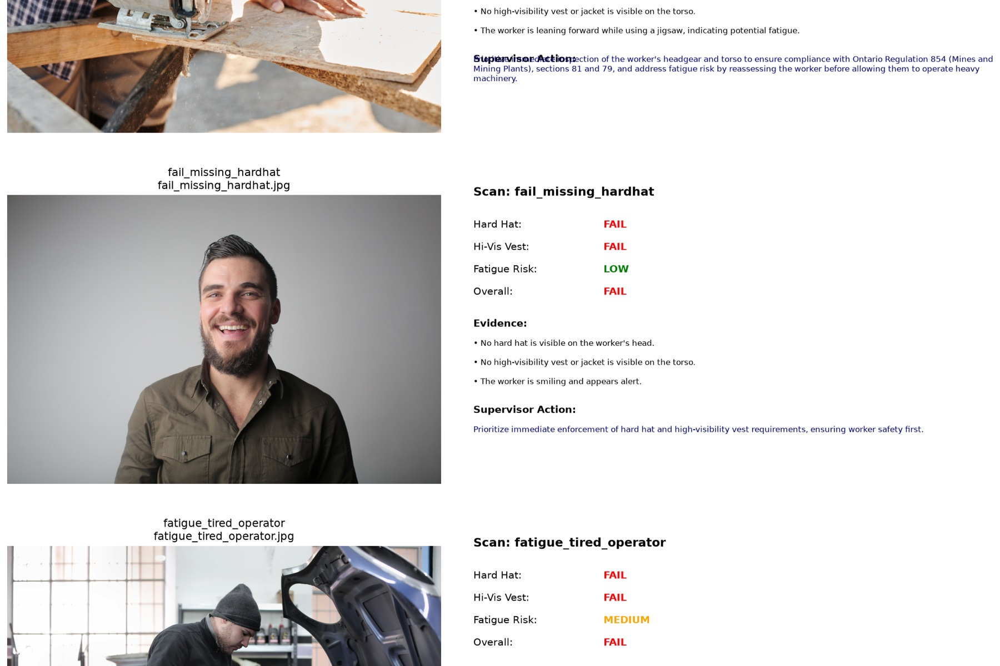
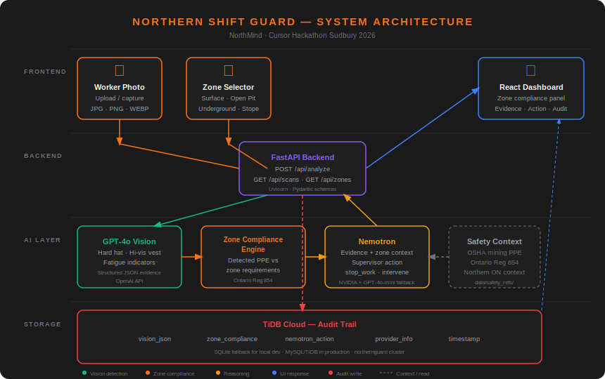
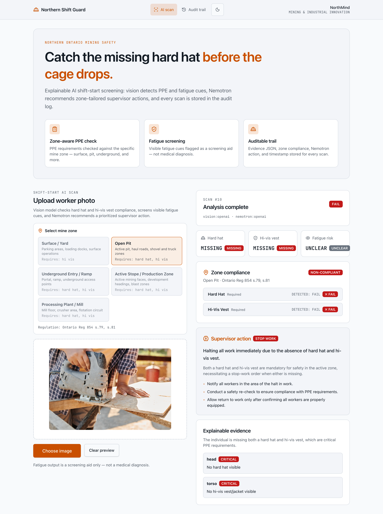

# Northern Shift Guard

**Explainable, zone-aware, auditable shift-start screening for Northern Ontario mines.**

[](https://cheickis.github.io/cursor-hackathon-sudbury-2026/winners/#gallery)
[](https://cheickis.github.io/cursor-hackathon-sudbury-2026/winners/#gallery)

| | |
|---|---|
| **Team** | [NorthMind](#team) — Kaysarul Anas Apurba · Kazeem Oguntade |
| **Track** | Mining & Industrial Innovation |
| **Event** | [Cursor Hackathon Sudbury 2026 — Build the North](https://cheickis.github.io/cursor-hackathon-sudbury-2026/winners/#gallery) · June 27, 2026 · Laurentian University |
| **Status** | ✅ Shipped — working prototype, Docker deploy, full audit trail |

<p align="center">
  
</p>

---

## Recognition

Northern Shift Guard placed **2nd overall** across all three hackathon tracks and won **Best Use of Nemotron** (NVIDIA Brev credits) for applying NVIDIA's open model family in an explainable mining safety workflow.

See the official [winners page & photo gallery](https://cheickis.github.io/cursor-hackathon-sudbury-2026/winners/#gallery).

<p align="center">
  
</p>

---

## What it does

Northern Shift Guard is a shift-start AI screening tool for Northern Ontario mining operations. A supervisor selects the mine zone a worker is about to enter, uploads a photo, and the system:

1. **Detects** PPE (hard hat, hi-vis vest) and visible fatigue cues via **GPT-4o vision**
2. **Checks zone compliance** against Ontario Reg 854 requirements — surface yard vs active stope vs open pit, not one global ruleset
3. **Reasons** over evidence with **NVIDIA Nemotron**, producing a plain-language prioritized supervisor action grounded in safety references
4. **Records** every scan in a **SQLite audit log** — zone, evidence JSON, compliance breakdown, Nemotron action, timestamp

**Key differentiator:** same photo, different zone → different compliance verdict and supervisor guidance. Two inspectable layers — *what was seen* and *what it means* — instead of one opaque score.

<p align="center">
  
  <br>
  <em>Shift-start dashboard — zone selector, image upload, and analysis pipeline</em>
</p>

<p align="center">
  
  <br>
  <em>Detection cards + zone compliance + Nemotron supervisor action</em>
</p>

---

## Architecture

```
Supervisor selects mine zone (e.g. Active Stope)
  → Upload worker photo
  → Vision model (OpenAI GPT-4o) → structured JSON { hard_hat, hi_vis, fatigue_risk, evidence[] }
  → Zone rules engine → per-item required / detected / compliant
  → Nemotron → zone-tailored supervisor action (plain language)
  → SQLite audit log → full scan history
  → UI: detection cards + zone compliance panel + Nemotron action
```

<p align="center">
  
</p>

---

## Stack

| Layer | Tool |
|-------|------|
| IDE | Cursor |
| Vision inference | OpenAI GPT-4o |
| Reasoning | NVIDIA Nemotron |
| Audit storage | SQLite (local / deployed) |
| Safety context | Apify-scraped refs in `data/safety_refs/` |
| Backend | FastAPI (Python) |
| Frontend | React + Vite (industrial UI) |
| Model work | Jupyter notebook |

---

## Quick start

```bash
# Both servers (recommended)
./run.sh

# Or manually:
# Backend
cd backend
python -m venv venv && source venv/bin/activate
pip install -r requirements.txt
cp ../.env.example ../.env   # fill in your keys
uvicorn main:app --reload

# Frontend (new terminal)
cd frontend
npm install
npm run dev
```

Open http://localhost:5173, select a mine zone, and upload a photo from `sample_images/`.

**Required env vars:** `OPENAI_API_KEY`, `VISION_PROVIDER=openai`, `NVIDIA_API_KEY` (or `NEMOTRON_PROVIDER=mock` for demo without Nemotron). See [`.env.example`](.env.example).

---

## Demo (~3 min)

1. Select **Active Stope / Production Zone**
2. Upload `sample_images/fail_missing_hardhat.jpg` → hard hat fail, zone non-compliant, Nemotron stop-work action
3. Switch zone to **Surface / Yard**, re-upload same image → hard hat not required; outcome may differ
4. Upload `sample_images/pass_compliant.jpg` in Open Pit → green compliant
5. Upload `sample_images/fatigue_tired_operator.jpg` → fatigue flag + monitor action
6. Open **Audit trail** tab → stored scans with zone, evidence JSON, and Nemotron action

**Judge moment:** same photo, different zone → different compliance verdict.

<p align="center">
  
</p>

---

## API

| Endpoint | Description |
|----------|-------------|
| `GET /health` | Health check |
| `GET /api/zones` | Mine zone definitions and PPE requirements |
| `POST /api/analyze` | Image + zone → vision JSON + zone compliance + Nemotron action |
| `GET /api/scans` | Scan history from audit log |

---

## Deploy

Production runs as a single Docker container (FastAPI serves API + built React UI).

```bash
docker build -t northern-shift-guard .
docker run -p 8000:8000 --env-file .env northern-shift-guard
```

Open http://localhost:8000

**Render:** connect this repo on [Render](https://render.com), choose **Web Service → Docker**, set env vars from `.env.example`, deploy. See [`render.yaml`](render.yaml) for the blueprint.

---

## Project structure

```
├── backend/              FastAPI API — vision, Nemotron, zone rules, audit log
├── frontend/             React dashboard (zone selector, analysis, audit trail)
├── notebooks/            Model eval + prompt tuning
├── data/safety_refs/     Mining / OSHA / Ontario Reg 854 context for Nemotron
├── sample_images/        Demo photos (pass / fail / fatigue)
├── submission_media/     Devpost gallery images + captions
├── docs/                 Project report, pitch deck, plan, architecture (see below)
├── scripts/              Screenshot capture + media prep
├── Cursor_Hackathon_Pics/ Event photos
├── Dockerfile            Single-container production build
└── render.yaml           Render deployment blueprint
```

---

## Documentation

| Resource | Description |
|----------|-------------|
| [`docs/README.md`](docs/README.md) | Index of all project docs |
| [`docs/PLAN.md`](docs/PLAN.md) | Master hackathon plan — phases, architecture, cut list |
| [`docs/devpost_story.md`](docs/devpost_story.md) | Inspiration, build story, challenges, learnings |
| [`docs/pitch_mobile.txt`](docs/pitch_mobile.txt) | Mobile pitch notes mapped to judge criteria |
| [`docs/system_architecture.svg`](docs/system_architecture.svg) | End-to-end pipeline diagram |
| [`docs/Northern_Shift_Guard_Project_Report.pdf`](docs/Northern_Shift_Guard_Project_Report.pdf) | Full project report |
| [`docs/Northern_Shift_Guard_Pitch_v2.pptx`](docs/Northern_Shift_Guard_Pitch_v2.pptx) | Pitch deck |
| [`submission_media/README.md`](submission_media/README.md) | Devpost gallery image order + captions |

---

## Team

**NorthMind** — built at [Cursor Hackathon Sudbury 2026](https://cheickis.github.io/cursor-hackathon-sudbury-2026/winners/#gallery)

| | |
|---|---|
| **Kaysarul Anas Apurba** | Explainable AI · backend · Nemotron integration |
| **Kazeem Oguntade** | Vision pipeline · frontend · demo |

---

## What's next

- Webcam / real-time capture at shift-start checkpoints
- Batch crew scanning before cage descent
- Expand PPE types (gloves, safety glasses, respirators, metatarsal boots) per zone
- Shift-over-shift compliance analytics and zone risk heatmaps
- WSIB / MOL report export from audit records

---

## Disclaimer

Fatigue screening is a visual aid only — not a medical diagnosis. All safety decisions remain with the on-site supervisor; Northern Shift Guard provides evidence and recommendations, not autonomous enforcement.
