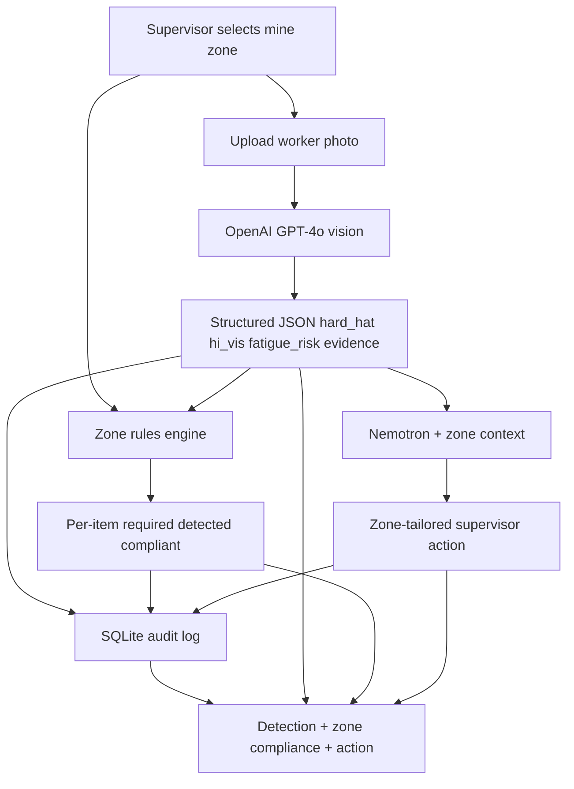
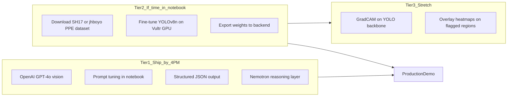

# Northern Shift Guard — Master Plan

> **Hackathon complete.** 🥈 2nd Place Overall · 🧠 Best Use of Nemotron — [Winners gallery](https://cheickis.github.io/cursor-hackathon-sudbury-2026/winners/#gallery). For final showcase status, see the [root README](../README.md).

**Team:** NorthMind  
**Category:** Mining & Industrial Innovation  
**Event:** Cursor Hackathon Sudbury 2026 — Build the North  
**Deadline:** 4:00 PM (June 27) — **submitted**  
**Workspace:** All work stays in `Cursor_Hackathon/`  
**Stack:** FastAPI + React + Jupyter notebook for model work

---

## One-sentence pitch

Northern Shift Guard is an explainable AI safety system for Northern Ontario mining sites that uses computer vision to detect PPE non-compliance and fatigue risk, checks each detection against zone-specific PPE requirements, Nemotron to reason over that evidence and recommend prioritized supervisor actions tailored to the selected zone, and a SQLite audit log so every flagged decision is traceable — not a black box.

---

## Problem

Northern Ontario mines are losing experienced tradespeople to retirement faster than they can backfill them, while safety reviews have flagged that new technology adoption itself introduces risk when it isn't paired with proper process. Shift-start PPE checks and fatigue screening are still manual, inconsistent, and undocumented — there's no fast, auditable way to catch a missing hard hat or a visibly fatigued operator before they're on the floor, and no record of why a call was made if something goes wrong later.

---

## Solution

A shift-start screening tool: supervisor selects a mine zone, uploads a worker photo, and the system:

1. **Detects** PPE (hard hat, hi-vis vest) and visible fatigue indicators via a vision model
2. **Compares** detections against zone-specific requirements (Surface vs Active Stope vs Open Pit, etc.) — per-item required / detected / compliant
3. **Reasons** over that evidence using **Nemotron**, enriched with zone context and safety-reference text (Apify), to produce a zone-tailored supervisor action — not just a flag, but what to do and why
4. **Records** every scan — zone, evidence JSON, compliance breakdown, Nemotron recommendation, timestamp — in **SQLite**, building a full audit trail

---

## Why this approach (not just another PPE detector)

Most PPE-compliance demos stop at "detected: no helmet." That's a description, not a decision. Northern Shift Guard adds a second reasoning layer: Nemotron weighs the detected evidence against safety-reference context to tell a supervisor *what matters most right now* — e.g., a missing hard hat is a stop-work issue, a moderate fatigue signal is a "monitor" issue, and the two shouldn't be treated the same. Pairing visual evidence (what was seen) with reasoned action (what it means) gives two independent, inspectable layers of explainability instead of one opaque score.

---

## Architecture



**Core pipeline (shipped):** zone selection → vision detection → zone compliance → Nemotron action → SQLite record → UI cards.

---

## Current progress

| Area | Status | Notes |
|------|--------|-------|
| Project scaffold | Done | `backend/`, `frontend/`, `notebooks/` |
| Safety reference text | Done | `data/safety_refs/` (OSHA, Ontario Reg 854, Northern context) |
| Model notebook | Done | `notebooks/northern_shift_guard.ipynb` |
| Model config export | Done | `backend/config/model_config.json` |
| Backend API | Done | `/health`, `/api/zones`, `/api/analyze`, `/api/scans` with vision + zone rules + Nemotron + SQLite |
| Zone-aware compliance | Done | 5 zones in `backend/config/zones.json`; per-item compliance panel in UI |
| Frontend | Done | Zone selector + detection + compliance + Nemotron action + audit trail |
| Sample images | Done | pass / fail / fatigue demo photos in `sample_images/` |
| Deployment | Done | Docker + Render blueprint (`Dockerfile`, `render.yaml`) |
| Submission | Done | Devpost, pitch deck, project report, gallery media |
| Awards | Done | 🥈 2nd Place Overall · 🧠 Best Use of Nemotron |

---

## Public datasets, training strategy & XAI

### Public datasets for this sector

**Yes for PPE / industrial safety vision — but mostly construction & manufacturing, not underground mining specifically.**

There is no widely used open dataset labeled "mining site only." For a hackathon, we use **industrial PPE datasets** that transfer well to mining surface operations (mill, yard, processing plant, open pit):

| Dataset | Size | Classes relevant to us | Link | Best for |
|---------|------|------------------------|------|----------|
| **SH17** | 8,099 images, 17 classes | Helmet, Safety-vest, Person, Head | [GitHub](https://github.com/ahmadmughees/SH17dataset) | Manufacturing/industrial — **recommended** (includes pre-trained YOLO weights) |
| **Construction-PPE** (Ultralytics) | Real construction scenes | helmet / no_helmet, vest / no_vest, gloves, boots | [Ultralytics docs](https://docs.ultralytics.com/datasets/detect/construction-ppe/) | Pass/fail PPE labels out of the box |
| **jhboyo/ppe-dataset** (Hugging Face) | 15,500 images | helmet, head (no helmet), vest | [Hugging Face](https://huggingface.co/datasets/jhboyo/ppe-dataset) | Fast YOLOv8 training — hard hat + vest |
| **51ddhesh/PPE_Detection** (Hugging Face) | ~668 MB, YOLO format | Helmet, Vest, Goggles, Gloves… | [Hugging Face](https://huggingface.co/datasets/51ddhesh/PPE_Detection) | General industrial PPE |

**Fatigue / drowsiness** (separate from PPE — no standard mining dataset):

| Dataset | Notes |
|---------|-------|
| **NTHU-DDD**, **UtaRLDD**, driver drowsiness sets | Driver-focused; usable for **visible fatigue cues** (eyes closed, head pose) but domain shift from mine operators |
| **Vision-LLM zero-shot** | Practical hackathon path — prompt model for visible fatigue cues without training |

**Mining-specific data we add ourselves:**

- `sample_images/` — 5–10 demo photos (pass/fail PPE, tired posture)
- **Apify** — public OSHA / Ontario MOL / WSIB safety text for Nemotron prompt context (not for training labels)

**Pitch to judges:** *"We train on public industrial PPE benchmarks (SH17 / Construction-PPE) and validate on mining-relevant demo scenarios — the same transfer-learning approach used when real mine sites lack labeled open data."*

---

### How we train the model (two-tier strategy)

Given the **4 PM deadline**, we use a **hybrid** — not full training from scratch:



#### Tier 1 — Primary (no custom training, ships the demo)

1. Open `notebooks/northern_shift_guard.ipynb`
2. Test **OpenAI GPT-4o** multimodal vision on `sample_images/`
3. Tune system prompt until JSON is stable: `{ hard_hat, hi_vis, fatigue_risk, evidence[] }`
4. Export prompt + model ID → `backend/config/model_config.json`
5. Backend calls vision API → zone compliance check → passes JSON + zone context to **Nemotron** → persists to SQLite

**This is what ships the demo if time is tight.**

#### Tier 2 — Optional fine-tune (notebook, ~1–2 hrs on Vultr GPU)

1. Download **jhboyo/ppe-dataset** or **Construction-PPE** (smallest/fastest to train)
2. In notebook:
   ```python
   from ultralytics import YOLO
   model = YOLO("yolov8n.pt")
   model.train(data="data/ppe/data.yaml", epochs=20, imgsz=640)
   ```
3. Evaluate on `sample_images/` — mAP, precision on helmet/vest
4. Save `backend/models/ppe_yolov8n.pt`
5. Backend: YOLO detects boxes → rules engine (helmet present? vest present?) → pass/fail → still feed Nemotron

**Fine-tune, not train from scratch** — YOLOv8n pretrained on COCO, 20 epochs on PPE data is realistic in a hackathon.

#### Tier 3 — Fatigue

- **No custom fatigue training in MVP** — vision LLM assesses visible cues from single frame
- Notebook documents limitations clearly for judges

---

### Explainable AI (XAI)

**Yes — hybrid XAI, playing to your MalariAI / Grad-CAM++ background.**

| Layer | XAI method | What the user sees |
|-------|------------|-------------------|
| **Vision LLM path** | Structured **natural-language evidence** | "Operator head region — no hard hat visible"; "High-vis vest not detected on torso" |
| **Nemotron path** | **Prioritized supervisor action** | Plain-language stop-work vs monitor guidance with reasoning |
| **YOLO path** (optional) | **Bounding boxes** on helmet / vest / head | Visual overlay on uploaded image |
| **YOLO + Grad-CAM++** (stretch) | **Heatmap** on backbone activations for flagged class | Same style as MalariAI — per-region spatial explainability |
| **Audit log** (SQLite) | **Traceability** | Every scan stores zone, evidence JSON, compliance breakdown, Nemotron action + timestamp |

**Minimum XAI for submission:** evidence bullets + pass/fail/unclear states + Nemotron action + stored audit record.  
**Strong XAI (if time):** YOLO boxes + Grad-CAM++ overlay on non-compliant detections.

---

## Hackathon tools map

| Tool | Credits / access | Role in this project |
|------|------------------|----------------------|
| **Cursor** | Claim hackathon credits | Primary IDE — backend, frontend, notebook, debugging |
| **OpenAI** | API key | **Primary** vision inference — GPT-4o multimodal PPE + fatigue screening |
| **Nemotron** (NVIDIA) | Special prize track | **Core** reasoning layer — evidence → prioritized supervisor action |
| **TiDB Cloud** | Not used (credits unavailable) | Replaced by SQLite audit log for demo |
| **Apify** | Promo `BIOLINKTRAT077` ($50) | Scrape public mining safety docs for Nemotron context |
| **Vultr** | Hackathon credits | GPU compute for notebook training + optional app hosting |
| **Lovable** | Code `CORI-CURS-74C0` (500 credits) | Rapid UI prototype / dashboard shell |
| **Locofy** | Event access | Design-to-code for React components (if using Figma) |
| **Vanna.AI** | Event tool | Optional — natural-language queries over scan history in DB |
| **Aptly** | Start-here checklist | Build, test, deploy AI-first app quickly |
| **Deepgram / Valsea** | Hackathon credits / free tier | Stretch — voice readout of supervisor action during demo |
| **Canva Pro** | Hackathon access | Pitch deck + demo thumbnail for Devpost |
| **Devpost** | Submission portal | Final project submission |
| **Discord** | Event channel | Questions, updates, mentor help |
| **GitHub** | Public repo required | Code publishing (no secrets) |
| **Luma** | Registration | Team / event registration |

---

## End-to-end workflow

```mermaid
flowchart TD
  subgraph phase0 [Phase0_Setup]
    A1[Open Cursor_Hackathon in Cursor]
    A2[Claim Cursor credits]
    A3[Create accounts OpenAI Vultr Lovable Apify Discord GitHub]
  end

  subgraph phase1 [Phase1_Data_and_Research]
    B1[Apify scrape mining safety guidelines]
    B2[Save to data/ and sample_images/]
    B3[Draft vision prompt + JSON schema]
  end

  subgraph phase2 [Phase2_Model_Work_ipynb]
    C1[notebooks/northern_shift_guard.ipynb]
    C2[Test OpenAI GPT-4o vision on sample_images]
    C3[Evaluate PPE + fatigue on sample_images]
    C4[Export model_config.json]
  end

  subgraph phase3 [Phase3_Backend]
    D1[FastAPI backend/]
    D2[POST /api/analyze vision + zone rules + Nemotron + SQLite]
    D3[Env vars in .env never commit keys]
  end

  subgraph phase4 [Phase4_Frontend]
    E1[Lovable dashboard prototype]
    E2[Polish React in frontend/]
    E3[Wire to FastAPI industrial Northern branding]
  end

  subgraph phase5 [Phase5_Deploy]
    F1[Aptly deploy backend + frontend]
    F2[Vultr host if needed]
    F3[Smoke test live demo URL]
  end

  subgraph phase6 [Phase6_Publish_and_Submit]
    G1[GitHub push public repo scrub secrets]
    G2[Canva pitch + demo thumbnail]
    G3[Record 2-min demo video]
    G4[Devpost submit under Mining track]
  end

  phase0 --> phase1 --> phase2 --> phase3 --> phase4 --> phase5 --> phase6
```



---

## Phase-by-phase detail

### Phase 0 — Setup · **Cursor, Discord, Luma**

1. Work only inside `Cursor_Hackathon/`.
2. Claim **Cursor credits** from the hackathon site.
3. Create / verify accounts: **OpenAI**, **Vultr**, **Lovable**, **Apify**, **GitHub**, **Devpost**, **Discord**.
4. Apply **Lovable** code `CORI-CURS-74C0` and **Apify** promo `BIOLINKTRAT077`.
5. Copy `.env.example` → `.env` locally (gitignored).

---

### Phase 1 — Data & research · **Apify, Cursor**

1. Use **Apify** actors to collect:
   - Public mining / OSHA / MOL PPE reference text (for Nemotron context).
   - 5–10 royalty-free industrial worker images (pass / fail PPE cases).
2. Save under:
   - `data/safety_refs/` — text snippets
   - `sample_images/` — demo photos (pass, fail PPE, fatigue posture)
3. Finalize analysis JSON schema and mining-tuned system prompt.

---

### Phase 2 — Model work in Jupyter · **Cursor, Vultr, OpenAI, notebook**

**File:** `notebooks/northern_shift_guard.ipynb`

**Notebook sections:**

1. **Setup** — load `sample_images/`, install `openai`, `pillow`, `opencv-python`, `matplotlib`
2. **OpenAI vision eval** — test GPT-4o on PPE detection; log latency + accuracy on samples
3. **Prompt tuning** — iterate structured JSON output (hard_hat, hi_vis, fatigue_risk, evidence[])
4. **Nemotron cell** — pass vision JSON + safety refs → supervisor narrative
5. **Optional YOLO baseline** (if time) — train/eval on public PPE dataset on **Vultr GPU**
6. **Explainability** (MalariAI angle) — Grad-CAM or attention overlays on flagged regions
7. **Export cell** — write `backend/config/model_config.json`

**Compute:** Run heavy cells on **Vultr GPU instance**; keep lightweight eval local.

---

### Phase 3 — Backend · **Cursor, OpenAI, Nemotron, SQLite**

```
backend/
├── main.py              # FastAPI + CORS
├── schemas.py           # Pydantic response models
├── vision_service.py    # OpenAI GPT-4o vision calls
├── nemotron_service.py  # Nemotron reasoning over evidence
├── prompts.py           # prompt from notebook export
├── db.py                # SQLite audit log
├── zone_service.py      # Zone definitions + compliance check
├── settings.py          # env config
├── config/
│   └── model_config.json
└── requirements.txt
```

**Endpoints:**

| Endpoint | Purpose |
|----------|---------|
| `GET /health` | Smoke test |
| `GET /api/zones` | Mine zone definitions and PPE requirements |
| `POST /api/analyze` | Image + zone → vision JSON + zone compliance + Nemotron action |
| `GET /api/scans` | Recent scans from SQLite audit log |

**Tool routing:**

- Primary inference: **OpenAI GPT-4o** vision (from notebook export)
- Fallback: **mock mode** if no API key configured
- Reasoning: **Nemotron** rewrites evidence into prioritized supervisor actions
- Storage: **SQLite** — `scans(id, timestamp, zone, ppe_json, compliance_json, evidence, actions)`

---

### Phase 4 — Frontend · **Lovable, Locofy, Cursor**

```
frontend/
├── src/
│   ├── App.tsx
│   ├── api.ts
│   └── components/
│       ├── ImageUpload.tsx
│       ├── AnalysisResult.tsx      # PPE cards + fatigue badge + evidence + Nemotron action
│       └── ScanHistory.tsx
└── package.json
```

**Workflow:**

1. **Lovable** — generate first dashboard layout (upload zone, result cards, history sidebar)
2. Export / recreate components in **Cursor** under `frontend/` (FastAPI wiring, optional webcam)
3. Target **Best AI UI** prize: high-contrast industrial theme, clear pass/fail/unclear states, disclaimer on fatigue screening

**If behind schedule:** skip webcam; upload-only still demos well.

---

### Phase 5 — Deployment · **Docker, Render**

1. **Docker** — multi-stage build: React frontend + FastAPI serving static + API
2. **Render** — connect GitHub repo, Web Service → Docker, set env vars from `.env.example`
3. Smoke test live URL with zone selector + 2 `sample_images/` test cases
4. Add demo URL to README

---

### Phase 6 — Publish & submit · **GitHub, Canva, Devpost**

**GitHub (public repo):**

- Push entire `Cursor_Hackathon/` project (exclude `.env`, `.venv`, large binaries)
- README: problem, solution, architecture diagram, tools used, setup steps

**Canva:**

- 1-slide pitch: problem → Northern Shift Guard → mining safety impact
- Devpost thumbnail

**Devpost checklist:**

- [ ] Project name + team name (NorthMind)
- [ ] Short + detailed description (Markdown)
- [ ] **Track:** Mining & Industrial Innovation
- [ ] Public **GitHub** link
- [ ] **Demo video** (2–3 min) or live site link
- [ ] List all hackathon tools used
- [ ] Confirm **no API keys** in repo

**Discord:** Post demo link in event channel if requested.

---

## Target folder structure

```
Cursor_Hackathon/
├── docs/PLAN.md                     ← master plan
├── README.md
├── .env.example
├── .gitignore
├── notebooks/
│   └── northern_shift_guard.ipynb   ← model eval + prompt tuning
├── backend/
│   ├── main.py
│   ├── schemas.py
│   ├── vision_service.py
│   ├── nemotron_service.py
│   ├── prompts.py
│   ├── db.py
│   ├── settings.py
│   ├── config/model_config.json
│   └── requirements.txt
├── frontend/
│   └── src/                         ← React + Vite
├── data/
│   └── safety_refs/                 ← Apify scraped text
├── sample_images/                   ← demo pass/fail photos
├── uploads/                         ← runtime uploads
└── docs/                            ← resume, event reference PDFs
```

---

## Timeboxed schedule (deadline 4:00 PM)

| Time | Phase | Tool focus | Deliverable |
|------|-------|------------|-------------|
| 10:30–11:00 | Setup | Cursor, Discord | Accounts + credits claimed |
| 11:00–11:30 | Data | Apify | `sample_images/` + safety refs |
| 11:30–1:00 | Models | notebook, OpenAI, Vultr | Working inference + exported config |
| 1:00–2:30 | Backend | Cursor, Nemotron, SQLite | `/api/analyze` + zone rules live locally |
| 2:30–3:30 | UI | Lovable, Cursor | Upload → results dashboard |
| 3:30–3:50 | Deploy | Docker, Render | Public demo URL |
| 3:50–4:00 | Submit | GitHub, Canva, Devpost | Submission complete |

---

## Demo script (~3 min)

1. **Problem** — Northern mines need faster, auditable, zone-aware PPE + fatigue screening at shift start.
2. **Zone context** — select **Active Stope**; explain that requirements differ by zone (Surface = hi-vis only; stope = hard hat + hi-vis).
3. **Fail case** — upload missing-hard-hat photo → detection panel + zone compliance rows (required / detected / fail) + Nemotron stop-work action tailored to stope.
4. **Same photo, different zone** — switch to **Surface / Yard** → hard hat not required; compliance may change. Shows context-aware logic.
5. **Pass case** — upload compliant worker in Open Pit → green compliant.
6. **Fatigue case** — visible fatigue cue → medium-risk flag, Nemotron recommends monitoring (screening aid only).
7. **Audit trail** — show SQLite-backed scan history with zone, evidence, and actions.
8. **Close** — explainable by design: what was seen, what the zone requires, whether each item complies, and what to do — not a black box.

---

## Risks & cut list (if behind)

| Cut first | Keep no matter what |
|-----------|---------------------|
| Webcam capture | Upload + analyze |
| YOLO training / Grad-CAM heatmaps | OpenAI vision + zone rules + Nemotron + SQLite |
| Voice narration (Deepgram / Valsea) | Structured JSON + evidence + Nemotron action |
| Vanna SQL chat | Scan history table |
| Locofy polish | Lovable or plain React |
| UI polish beyond pass/fail/unclear | Core pipeline end-to-end |

---

## Success criteria at 4:00 PM

- [ ] `notebooks/northern_shift_guard.ipynb` runs and documents model choice
- [ ] Live demo: zone select → image → PPE + zone compliance + Nemotron action + evidence
- [ ] SQLite stores scan history (audit trail tab)
- [ ] Public GitHub repo — no secrets
- [ ] Devpost submitted under **Mining & Industrial Innovation**
- [ ] Demo ties to your explainable AI / CV research background

---

## Next step

Say **"execute the plan"** to continue from current progress: deploy to Render, push GitHub, and submit.
